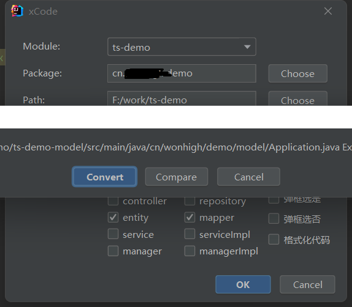
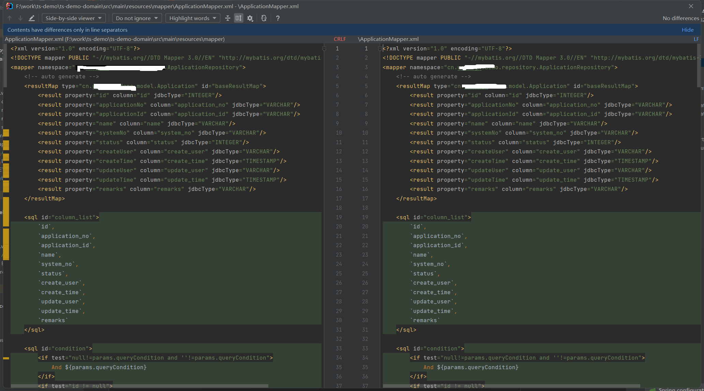

# xCode

## xCode能做什么？

> xCode是基于[EasyCode](https://gitee.com/makejava/EasyCode.git)开源组件基础上根据现有项目模板，在IntelliJ IDEA Ultimate版开发的一个代码生成插件，主要通过自定义模板（基于velocity）来生成各种你想要的代码。通常用于生成Entity、Dao、Service、Controller。如果你动手能力强还可以用于生成HTML、JS、PHP等代码。理论上来说只要是与数据有关的代码都是可以生成的。
---
## 使用环境
`IntelliJ IDEA Ultimate版（2021.3.3）`

## 支持的数据库类型
#### 因为是基于Database Tool开发，所有Database Tool支持的数据库都是支持的。
### 注意mycat不支持，请使用tidb
包括如下数据库：
> 1. MySQL
> 2. SQL Server
> 3. Oracle
> 4. PostgreSQL
> 5. Sqlite
> 6. Sybase
> 7. Derby
> 8. DB2
> 9. HSQLDB
> 10. H2
> 11. TIDB
>  
> 当然支持的数据库类型也会随着Database Tool插件的更新同步更新。

## 功能说明：
* 支持多表同时操作
* 支持同时生成多个模板
* 支持自定义模板
* 支持自定义类型映射（支持正则）
* 支持自定义附加列
* 支持列附加属性
* 所有配置项目支持分组模式，在不同项目（或选择不同数据库时），只需要切换对应的分组，所有配置统一变化。
 
## 安装
插件：[下载](http://help.ts.belle.net.cn/release/)

> ##### 说明文档：
> ``` 说明文档：
> 1. 安装完毕后重启生效。
> 2. 版本更新时不会覆盖现有模板。
> 3. 不要解压zip包，安装时直接选zip包即可。
> ```  

## 使用
> idea（需要企业版）打开右侧 Database 面板,点击+增加数据源
> 注意，非必要请选择Default Schema，避免加载过多的数据库
> 
> 配置好数据源之后，选择对应的数据库下面的一个或者多个表，点击Generate Code
> 
> 弹出面板之后设置对应的参数：
> 
> ```详细说明
> Module：选择对应的模块，如果需要生成多个module的代码，请选择父模块
> Packege：包名。注意，包名已经在模板中按照现有项目的规范做了对应，因此只需要选择父模块的包名即可，例如 cn.wohigh.retail.pos.web 只需要选择cn.wonhigh.retail.pos。不需要带web了
> Path：同理如果多模块请选择父模块所在文件夹，如果是单个模块请选择模块所在的文件夹即可，不需要到包名对应的文件夹下面。
> RemovePre：需要移除的表前缀，例如:tbl_,
> ExtendTemplate：扩展模板文件夹，详见扩展模板说明
> Template：模板，默认提供Spring，SpringBoot 两套模板，分别对应base-framework和topmall 两套框架
> 弹出选是：生成过程中会提示，是否创建目录不存在的目录，是否覆盖现有文件，如果是增量更新，强烈不建议勾选
> ```
### 覆盖更新
> #### 说明: 
> * 日常经常会有表增加字段的情况，一般情况下只需要更新Model和Mapper，这时就需要使用Compare增量的方式来更新现有文档，由于实际情况下Mapper.xml会非常复杂，因此增量更新的时候需要慎重
> * 选择对应的表，弹出生成对话框，对应的模板，一般选择entity和mapper，注意别勾选【弹框选是】，点击OK，生成代码
> * 如果Mapper存在系统会弹出提示，注意确认Mapper文件存在，但是没有弹出提示，请确认选择的路径和包是否正确。
> 
> 点击提示框中间按钮【Compare】
> 
> * 左侧是现有文件内容，右侧是生成的文件内容，注意：当关闭窗口时会使用右侧的内容覆盖当前文件，因此需要根据实际情况，点击调换左右内容。对比工具详细使用说明参见idea的对比工具
> * 由于历史文件和代码生成工具生成的代码现阶段差异比较大，因此对比工具效果不是很好，后续如果保持一致效率会更好


# 参考
https://github.com/PerccyKing/batslog.git

https://github.com/zhengjunbase/codehelper.generator

https://github.com/starxg/mybatis-log-plugin-free

# TODO
自动补全manager, service, dal 代码

